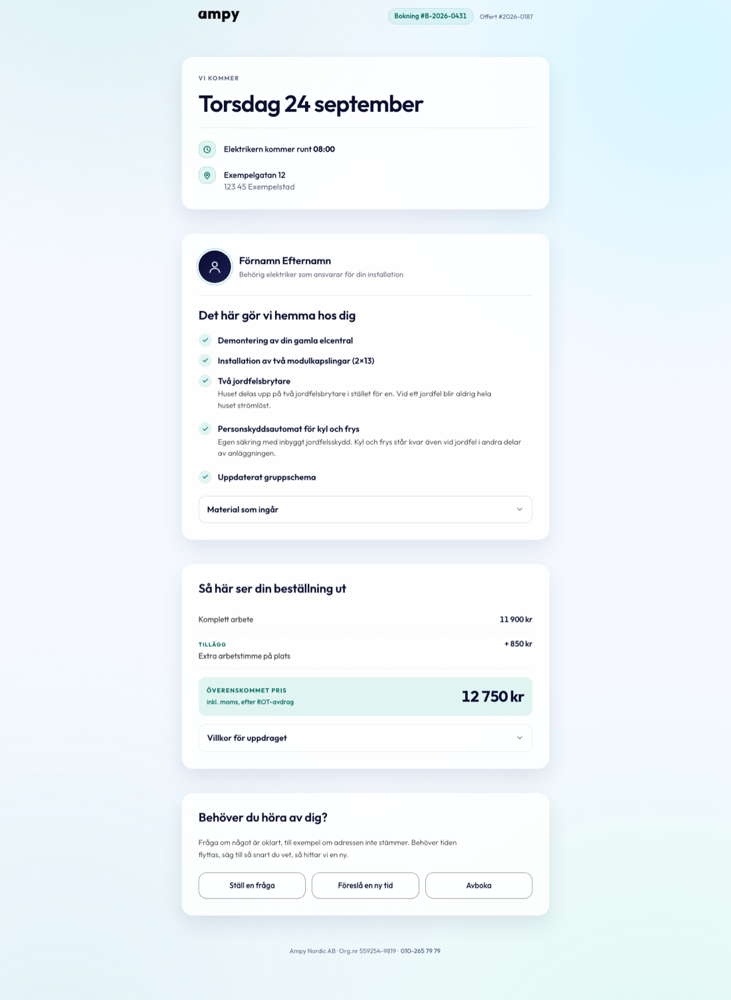
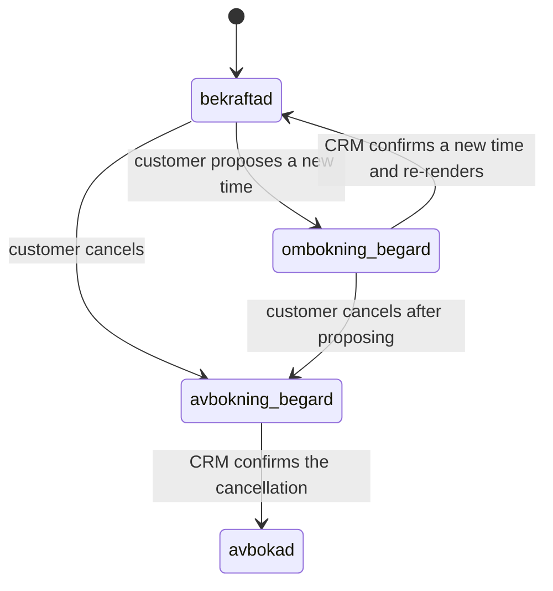
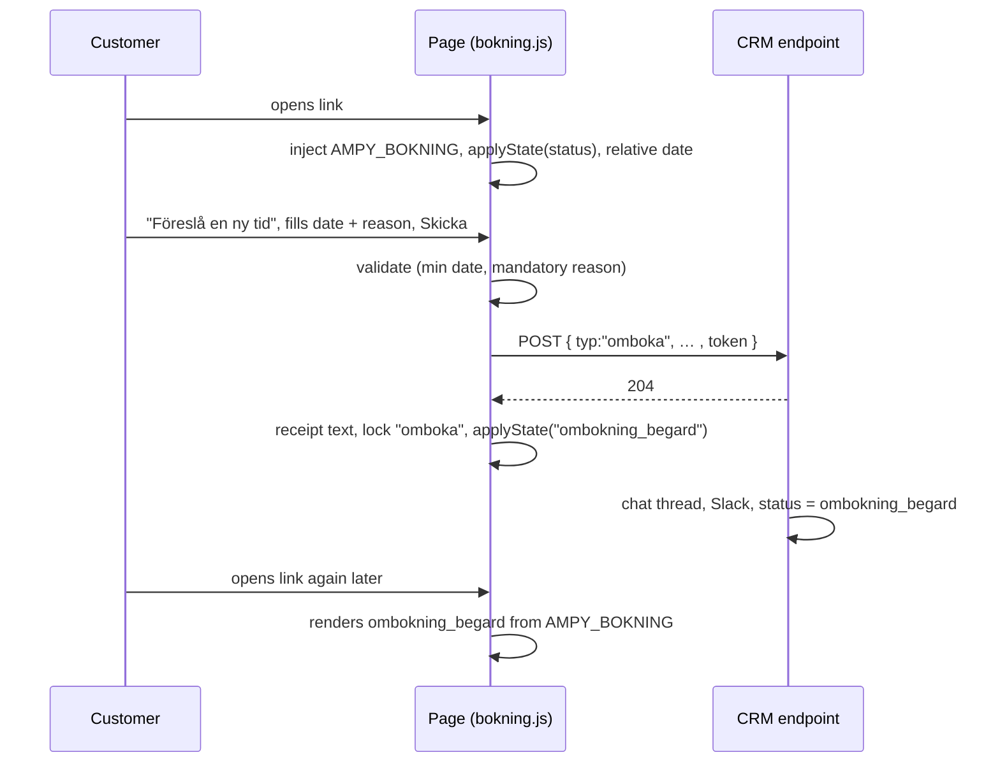
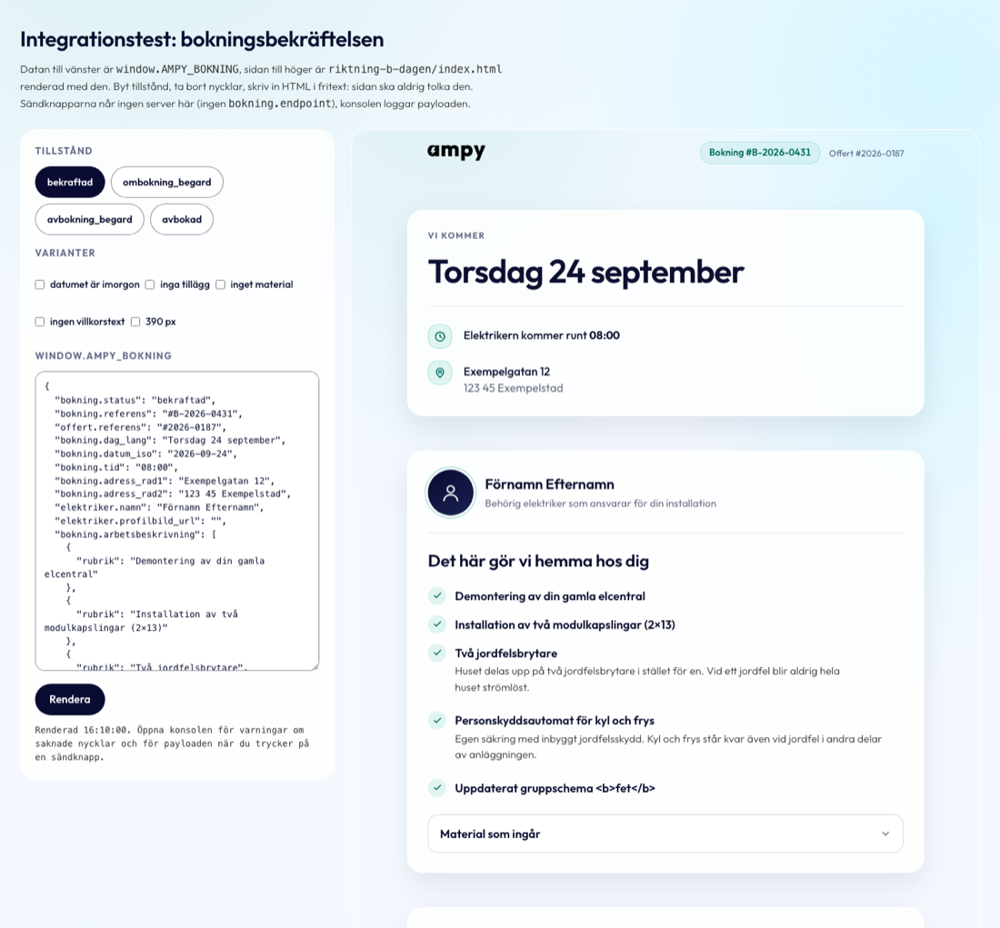
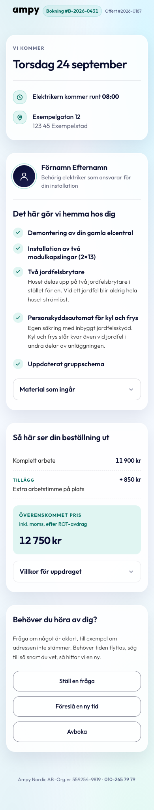

# Booking confirmation — developer handover

**For:** Yassine · **From:** Julius (Ampy Nordic AB) · **Version:** 2026-09-02
**Page:** the confirmation a customer receives once a quote is accepted and a time is booked.
**Sibling of:** the quote page (`Ampy-nordic/offert-mall`). Same design system, same `shared.css`,
same data-injection pattern. Most of what you built for the quote page carries over.

- Live prototype: https://julius447.github.io/Booking-confirmation/riktning-b-dagen/
- Integration test page: https://julius447.github.io/Booking-confirmation/exempel-integration.html
- Repository: https://github.com/julius447/Booking-confirmation

---

## 0. In five lines

1. **One page**: `riktning-b-dagen/index.html` + `assets/bokning.css` + `assets/bokning.js`.
2. The CRM renders it with **`window.AMPY_BOKNING`** placed before `bokning.js` (§4). Every
   customer-specific value has a `data-oa` hook; the page never interprets HTML.
3. **`bokning.status`** drives what the page claims (§6): `bekraftad`, `ombokning_begard`,
   `avbokning_begard`, `avbokad`.
4. Three customer actions (ask a question, propose a new time, cancel) **POST JSON to
   `bokning.endpoint`** with a per-booking `bokning.token` (§7). The CRM fans out to chat and Slack.
5. Prove it with **`exempel-integration.html`** and the acceptance list in §13 before go-live.

---

## 1. What this page is, and is not

The quote page meets a customer who has to **decide**. This page meets a customer who
**already has**. That is why it has no summary panel, no price anchor, no upsell and no urgency:
nothing on it is a sales device. The anchors are **the time** and **the electrician**. The price
is shown as a receipt of what was agreed, never as a payment demand.

Two rules follow from that and are enforced in the code:

- **The page never claims more than "received".** When the customer proposes a new time or
  cancels, the page says the message was received; confirmation comes from the CRM on the next
  visit via `bokning.status`.
- **Nothing is invented.** Values the CRM does not supply are left as visible placeholders with a
  console warning, never guessed or hidden.

---

## 2. Deliverable and files

| File | Role | Port to CRM? |
|---|---|---|
| `riktning-b-dagen/index.html` | The template. 235 lines. Every per-customer value carries a hook. | **Yes** |
| `assets/bokning.css` | Everything specific to this page. 233 lines, commented. | **Yes** |
| `assets/bokning.js` | Injection layer, state model, the three actions, relative date, print. ES5, no dependencies, 342 lines. | **Yes** |
| `assets/shared.css` | Verbatim copy of the quote page's stylesheet. This page uses about 19 % of it (exact list in §10). Do not edit here. | Already ported |
| `assets/tokens.css` | Verbatim production design tokens. Loaded for parity; `shared.css` re-declares what it needs. | Already ported |
| `assets/fonts/Outfit-latin.woff2` | Self-hosted font. The latin subset is enough; latin-ext is never requested. | Already ported |
| `assets/ampy-logo-dark.png` | Header logo, 1600×468 intrinsic. | Already ported |
| `exempel-integration.html` | Developer test page (§13). Renders the template with sample data, switches states, feeds hostile strings. | No, dev only |
| `docs/skarmbilder/` | Reference screenshots of every state and flow (§16). | No |
| `docs/granskning-2026-09-02.md` | The review log (Swedish): what was found and why the code looks the way it does. | No |

**Do not implement** `riktning-a-kallelsen/` and `riktning-c-kvittensen/`. They are frozen design
drafts kept for comparison and run on their own frozen copies of the CSS and JS
(`assets/utkast/`).

Load order in `<head>`: `tokens.css` → `shared.css` → `bokning.css`. Scripts at the end of
`<body>`: the data object first, then `bokning.js`.

Transfer weight, gzipped: HTML 4.3 kB · CSS (all three) 24.9 kB · JS 5.8 kB · font 32 kB · logo
12 kB. No third-party requests, no tracking, no cookies.

---

## 3. Anatomy



```
header   .of-top              logo · booking reference (pill) · quote reference
main     .bk-flow
  card 1 .bk-card.bk-hero     label over the date ("Vi kommer") · the date as <h1>, with an
                              optional "Imorgon," prefix · optional status line
                              divider · arrival time · address
  card 2 .bk-card             electrician (photo, name, role) · divider
                              h2 "Det här gör vi hemma hos dig" · work items · material (collapsed)
  card 3 .bk-card             h2 "Så här ser din beställning ut" · base row · add-on rows
                              total plate · terms (collapsed) with link to general terms
  card 4 .bk-card             h2 "Behöver du höra av dig?" · intro · three buttons, each with
                              its panel directly after it
footer   .of-foot             company · org. no. · phone
```

On phones (below 480 px) the cards keep the same order; the three action buttons stack, and each
panel opens directly under its own button. From 680 px the buttons sit on one row and the open
panel spans the row below them.

---

## 4. Data contract: `window.AMPY_BOKNING`

### 4.1 Placement and serialisation

```html
<script>window.AMPY_BOKNING = {…};</script>
<script src="assets/bokning.js"></script>
```

Serialise server-side with:

```js
JSON.stringify(data)
  .replace(/</g, "\\u003c")
  .replace(/
/g, "\\u2028")
  .replace(/
/g, "\\u2029")
```

so that free text can never terminate the script element. The page writes every value with
`textContent` or `createElement`, never `innerHTML`; the test page feeds `<script>`,
``, `</script>` inside strings and a `javascript:` photo URL, and all of them render
as literal text (§13, test 3).

### 4.2 Behaviour when data is missing

- **No `window.AMPY_BOKNING` at all** → prototype mode. The example values in the markup stay and
  the action buttons only give a local receipt. This is what the GitHub Pages prototype shows.
- **Object present, required key missing or empty** → the example value stays visible (for
  example `[Elektriker]`) and the console logs
  `[bokning] AMPY_BOKNING saknar <key>; exempelvärdet står kvar.` Treat any such warning as a data
  bug; the placeholders are in brackets precisely so that QA sees them.
- **Optional key empty** → the element is removed (`data-oa-valfri`).
- **List key missing or empty** → the block is removed (never example rows for a real customer).

### 4.3 Keys

| Key | Req. | Type / format | Example | What the page does with it |
|---|---|---|---|---|
| `bokning.status` | yes | one of §6 | `"bekraftad"` | Drives the state. Unknown value → `bekraftad`. |
| `bokning.referens` | yes | string | `"#B-2026-0431"` | Header pill. Sent with every action. |
| `offert.referens` | yes | string | `"#2026-0187"` | Header. Sent with every action. |
| `bokning.dag_lang` | yes | string, capitalised | `"Torsdag 24 september"` | The visible date. The script lower-cases the weekday only when it prefixes "Imorgon,". |
| `bokning.datum_iso` | yes | `YYYY-MM-DD` | `"2026-09-24"` | Written to `<time datetime>`. "Idag / Imorgon / I övermorgon" is computed from it in the customer's local time. **Must agree with `dag_lang`.** Missing or malformed → no relative prefix, plus a warning. |
| `bokning.tid` | yes | string | `"08:00"` | One arrival time, not a window (owner decision). Rendered bold, never wraps. |
| `bokning.adress_rad1` | yes | string | `"Exempelgatan 12"` | Street line. |
| `bokning.adress_rad2` | yes | string | `"123 45 Exempelstad"` | Postcode and town, shown as a second line. |
| `elektriker.namn` | yes | string | `"Förnamn Efternamn"` | The assigned electrician. |
| `elektriker.profilbild_url` | no | `https://…` | | Replaces the silhouette with `` (64×64, `object-fit: cover`, `alt=""`). **Only `https:` URLs are accepted**; anything else keeps the silhouette silently. |
| `bokning.arbetsbeskrivning` | yes | array of `{ rubrik, beskrivning? }` or plain strings | see §4.4 | One `<li>` per item: `<h3>` for `rubrik`, optional `<p>` for `beskrivning`. Empty or missing → the work block **and its heading** are removed, with a warning. |
| `bokning.material` | no | `string[]` | | The collapsed "Material som ingår" list. Empty or missing → the expander is removed. |
| `bokning.grundbelopp_text` | yes | pre-formatted string | `"11 900 kr"` | First receipt row ("Komplett arbete"). **Format in the CRM**: non-breaking space as thousands separator, "kr". The page does no arithmetic. |
| `bokning.tillagg` | no | array of `{ namn, belopp_text }` | `[{ "namn": "Extra arbetstimme på plats", "belopp_text": "+ 850 kr" }]` | One receipt row per item under the "Tillägg" tag. `[]` or missing → no rows. The example row in the markup is a template and is always removed when data is present. |
| `bokning.total_text` | yes | pre-formatted string | `"12 750 kr"` | The total. Must equal base plus add-ons; the page does not check. |
| `bokning.total_not` | yes | string | `"inkl. moms, efter ROT-avdrag"` | The qualifier under the total. Send `"inkl. moms"` for a booking without ROT. |
| `bokare.villkorstext` | no | string | | The booker's job-specific terms inside "Villkor för uppdraget". Empty → the paragraph is removed; the link to the general terms (`https://ampy.se/kopvillkor`) stays. |
| `bokning.token` | yes | string | | Unguessable per-booking secret, sent in every action payload. See §7.3. |
| `bokning.endpoint` | yes in prod | URL | `"/api/bokning/handling"` | Where the three actions POST. Missing → prototype mode (local receipt, payload logged to the console). |

### 4.4 Complete example

```json
{
  "bokning.status": "bekraftad",
  "bokning.referens": "#B-2026-0431",
  "offert.referens": "#2026-0187",
  "bokning.dag_lang": "Torsdag 24 september",
  "bokning.datum_iso": "2026-09-24",
  "bokning.tid": "08:00",
  "bokning.adress_rad1": "Exempelgatan 12",
  "bokning.adress_rad2": "123 45 Exempelstad",
  "elektriker.namn": "Förnamn Efternamn",
  "elektriker.profilbild_url": "https://crm.example/media/elektriker/123.jpg",
  "bokning.arbetsbeskrivning": [
    { "rubrik": "Demontering av din gamla elcentral" },
    { "rubrik": "Två jordfelsbrytare",
      "beskrivning": "Huset delas upp på två jordfelsbrytare i stället för en. Vid ett jordfel blir aldrig hela huset strömlöst." },
    "Uppdaterat gruppschema"
  ],
  "bokning.material": ["2 st modulkapsling 2×13", "2 st jordfelsbrytare", "Installationsmaterial"],
  "bokning.grundbelopp_text": "11 900 kr",
  "bokning.tillagg": [{ "namn": "Extra arbetstimme på plats", "belopp_text": "+ 850 kr" }],
  "bokning.total_text": "12 750 kr",
  "bokning.total_not": "inkl. moms, efter ROT-avdrag",
  "bokare.villkorstext": "Vi behöver komma åt elcentralen och huvudbrytaren. Strömmen är av under delar av arbetet.",
  "bokning.token": "b7f1…unguessable…",
  "bokning.endpoint": "/api/bokning/handling"
}
```

---

## 5. Hook reference

Everything dynamic is declared in the markup; the script only reads attributes. If you port the
template to another templating system, keep these attributes and the script keeps working.

| Attribute | On | Behaviour |
|---|---|---|
| `data-oa="key"` | any text element | `textContent = value` when the key is non-empty. |
| `data-oa-valfri` | together with `data-oa` | Element removed when the key is empty. Used on `bokare.villkorstext`. |
| `data-oa-list="key"` | `<ul>` | List rebuilt from the array. `bokning.arbetsbeskrivning` items are `<li><span class="w-check">…</span><div><h3>…</h3><p>…</p></div></li>` (the check icon is cloned from the first example row); `bokning.material` items are plain `<li>`. |
| `data-oa-photo="key"` | the placeholder `<svg>` | Replaced by `` for an `https:` URL. |
| `data-oa-tillagg` | the template `<div class="bk-row">` | Cloned once per item in `bokning.tillagg`; the sub-hooks `data-t="namn"` and `data-t="belopp_text"` inside it receive the values. The template itself is removed. |
| `datetime` | `<time>` | Set from `bokning.datum_iso`. The relative-date logic reads this attribute, never the visible text. |
| `data-rel` | the `<span>` before the date | Receives "Idag," / "Imorgon," / "I övermorgon," and is unhidden. |
| `data-state-show="a b"` | any element | Visible only in the listed states. |
| `data-state-hide="a b"` | any element | Hidden in the listed states. |
| `data-varfor`, `data-nytt-datum`, `data-nytt-fonster` | form fields | Read on send. The fields also carry `name` attributes matching the payload keys. |
| `data-skicka` | the send button in each panel | Wired to validation and sending. |
| ids `fraga-btn/-panel`, `omboka-btn/-panel`, `avboka-btn/-panel` | | The three actions. A missing pair is skipped, so a section can be removed without breaking the script. |

---

## 6. State model: `bokning.status`

`applyState()` runs once at load from `bokning.status` and again after a successful action, so
the CRM-rendered state and the in-session state share one code path. Variants live in the markup
as `data-state-show` / `data-state-hide`; the script toggles the `hidden` attribute and
`bokning.css` guarantees `[hidden]` always wins.

| Status | Set by | Label over the date | Arrival fact | Status line under the date | Card 4 intro | Actions open | `<title>` |
|---|---|---|---|---|---|---|---|
| `bekraftad` | CRM (default) | Vi kommer | shown | none | standard | all three | Din bokning är klar · Ampy |
| `ombokning_begard` | customer sent "Föreslå en ny tid"; CRM stores it | Vi kommer | shown | Du har föreslagit en ny tid. Den här tiden gäller tills vi har bekräftat något annat. | standard | question, cancel | Din bokning är klar · Ampy |
| `avbokning_begard` | customer sent "Avboka"; CRM stores it | Avbokning mottagen | hidden | Vi har tagit emot din avbokning. | "Ändrade du dig? Ring oss på 010-265 79 79, så bokar vi en ny tid." | question | Avbokning mottagen · Ampy |
| `avbokad` | CRM, after a person confirmed the cancellation | Avbokad | hidden | Tiden är avbokad. Vill du boka en ny tid, ring oss på 010-265 79 79. | same as above | question | Bokningen är avbokad · Ampy |

Transitions:



In words: the page can move a booking **forward** (to `ombokning_begard` or `avbokning_begard`)
but never back. Only the CRM can return a booking to `bekraftad` (with a new date and time) or
finalise it as `avbokad`. There is no "completed" state; simply stop sending the link once the
visit is done.

Locking rules, applied both at load and after a send:

- A locked action is a **disabled button** (`.of-btn-secondary:disabled`, 45 % opacity, no hover).
- A panel completed **in the same session** stays open with its receipt text; its own button no
  longer collapses it, and opening another panel does not close it.
- If the customer cancels after having proposed a new time, the proposal panel's receipt is
  rewritten to "Förslaget gäller inte längre eftersom du avbokade efteråt."
- "Ställ en fråga" is never locked.

`window.ampyBokningState()` returns `{ status, referens, skickat: ["omboka", …] }` for tests.

---

## 7. Actions and the API the CRM must provide

### 7.1 Client behaviour

Each panel validates locally, then sends. The button is disabled while the request is in flight
and stays disabled on success. On failure it is re-enabled and the status line shows
"Vi kunde inte skicka just nu. Ring oss på 010-265 79 79 så tar vi det direkt." No automatic
retries.

Validation (first failure stops, marks the field with `aria-invalid="true"` +
`aria-describedby` pointing at the status line, and moves focus to it):

| Panel | Field | Rule | Message |
|---|---|---|---|
| Ställ en fråga | `text` | not empty | Skriv din fråga i rutan först, så vet vi vad du undrar över. |
| Föreslå en ny tid | `nytt_datum` | not empty | Välj ett datum som skulle passa dig. |
| | `nytt_datum` | ≥ today, local time | Det datumet har redan varit. Välj ett datum framåt i tiden. |
| | `anledning` | not empty | Skriv kort varför tiden inte passar, så vet vi hur vi ska lösa det. |
| Avboka | `anledning` | not empty | Skriv kort varför du avbokar innan du skickar. |

The date input also gets `min` = today (local time, not UTC) at load. The reason is mandatory by
owner decision; the check is honest, not nagging: it says what is missing and moves focus there.

### 7.2 Request

`POST {bokning.endpoint}` · `Content-Type: application/json` · `credentials: same-origin`.

Every payload carries `typ`, `bokning` (reference), `offert` (reference) and `token`. Field
names match the `name` attributes in the markup.

```json
{ "typ": "fraga",  "bokning": "#B-2026-0431", "offert": "#2026-0187", "token": "…",
  "text": "Kan ni titta på uttaget i garaget samtidigt?" }
```
```json
{ "typ": "omboka", "bokning": "#B-2026-0431", "offert": "#2026-0187", "token": "…",
  "nytt_datum": "2026-10-02", "fonster": "em", "anledning": "Jag är bortrest den veckan." }
```
`fonster` is one of `fm` (förmiddag), `em` (eftermiddag), `nar` (spelar ingen roll).
```json
{ "typ": "avboka", "bokning": "#B-2026-0431", "offert": "#2026-0187", "token": "…",
  "anledning": "Vi har fått en annan lösning." }
```

### 7.3 Response and server responsibilities

Any **2xx** means "received"; the body is ignored (`204 No Content` is fine). Any other status,
or a network error, shows the error text and re-enables the button. Use the same generic error
for an invalid token; do not tell the browser why.

| `typ` | Server must | Then |
|---|---|---|
| `fraga` | Validate token. Create a chat thread on the booking with the text. Notify Slack. | Status unchanged. |
| `omboka` | Validate token. Store the proposal (`nytt_datum`, `fonster`, `anledning`). Set `bokning.status = ombokning_begard`. Notify Slack. | The booked time stays until a person confirms a new one and sets `bekraftad` with the new date. |
| `avboka` | Validate token. Store `anledning`. Set `bokning.status = avbokning_begard`. Notify Slack. Stop reminders for the slot. | A person confirms → `avbokad`. |

Security requirements that follow from the design:

- **Token.** Booking references look sequential (`#B-2026-0431`). Without the token anyone who
  can guess a reference could cancel a booking. Generate an unguessable `bokning.token` per
  booking, render it into `AMPY_BOKNING`, and reject every action without a valid one.
- **URL.** The token is rendered into the page, so the page URL itself must be unguessable
  (for example `/bokning/<uuid>`), the page must stay `noindex, nofollow` (it is), and the link
  should only be sent to the customer's own channel.
- **Slack never from the browser.** A webhook URL in the page is a public secret. The page talks
  to one endpoint; the CRM fans out.
- **Idempotency.** The customer can retry after an error. Deduplicate on
  (`bokning`, `typ`, reason text) within a short window, or accept duplicates in the chat thread.
- **Rate limiting** the endpoint per token is cheap insurance.

### 7.4 Flow



---

## 8. Behaviour worth knowing

- **Relative date.** "Idag," / "Imorgon," / "I övermorgon," is prefixed to the date when the
  visit is 0–2 days away, computed against local midnight (so "imorgon" means tomorrow, not "in
  24 hours"). Only in `bekraftad` and `ombokning_begard`. Requires a valid `bokning.datum_iso`.
- **Panels.** One open at a time. Focus moves into the first field on open, and to the status
  line after sending, so screen readers hear the result (`role="status"`).
- **Print.** `shared.css` hides the buttons, `bokning.css` hides the panels and the send buttons,
  and `bokning.js` opens both `<details>` on `beforeprint` so the material list and the terms
  print. See `docs/skarmbilder/13-utskrift.pdf`.
- **Reduced motion** is honoured by `shared.css`: all animations and transitions off.
- **No calendar file.** The "Lägg till i kalendern" button was removed by the owner; there is no
  `.ics` code in the shipped script and no end time anywhere on the page.
- **No tracking.** If the CRM wants events (page opened, action sent), hook them at the `fetch`
  in `bokning.js` and gate them on consent; nothing is included.

---

## 9. Copy inventory

Every customer-facing string, where it lives, and its status. Strings marked **new** were
written on 2026-09-02 for the state model and have **not yet been signed off by the owner**;
implement them as they are and expect small wording changes.

**Header and card 1** (`index.html`)

| String | Where | State |
|---|---|---|
| Bokning · Offert | header labels | all |
| Vi kommer | label over the date | bekraftad, ombokning_begard |
| Avbokning mottagen · **new** | label over the date | avbokning_begard |
| Avbokad · **new** | label over the date | avbokad |
| Idag, / Imorgon, / I övermorgon, | prefix before the date (JS) | bekraftad, ombokning_begard |
| Du har föreslagit en ny tid. Den här tiden gäller tills vi har bekräftat något annat. · **new** | status line | ombokning_begard |
| Vi har tagit emot din avbokning. · **new** | status line | avbokning_begard |
| Tiden är avbokad. Vill du boka en ny tid, ring oss på 010-265 79 79. · **new** | status line | avbokad |
| Elektrikern kommer runt [tid] | arrival fact | bekraftad, ombokning_begard |

**Card 2**

| String | Where |
|---|---|
| Behörig elektriker som ansvarar för din installation | role under the name (static) |
| Det här gör vi hemma hos dig | h2 |
| Material som ingår | expander |

**Card 3**

| String | Where |
|---|---|
| Så här ser din beställning ut | h2 |
| Komplett arbete | base row label |
| Tillägg | tag on add-on rows |
| Överenskommet pris | total label |
| Villkor för uppdraget | expander |
| Läs våra allmänna köpvillkor (öppnas i ny flik) | link; the parenthesis is screen-reader only |

**Card 4**

| String | Where | State |
|---|---|---|
| Behöver du höra av dig? | h2 | all |
| Fråga om något är oklart, till exempel om adressen inte stämmer. Behöver tiden flyttas, säg till så snart du vet, så hittar vi en ny. | intro | bekraftad, ombokning_begard |
| Ändrade du dig? Ring oss på 010-265 79 79, så bokar vi en ny tid. · **new** | intro | avbokning_begard, avbokad |
| Ställ en fråga · Föreslå en ny tid · Avboka | the three buttons | |
| Stämmer inte adressen, eller undrar du över något inför besöket? Skriv här så svarar vi. | question hint | |
| Vad undrar du över? · placeholder: Till exempel: kan ni titta på uttaget i garaget samtidigt? | question field | |
| Skicka frågan | button | |
| Vi bekräftar innan något ändras. Den nuvarande tiden står kvar tills du hört av oss. | new-time hint | |
| Vilket datum skulle passa? · När på dagen? (Förmiddag / Eftermiddag / Spelar ingen roll) | fields | |
| Varför passar inte den bokade tiden? · placeholder: Till exempel: jag är bortrest den veckan | field | |
| Skicka förslaget | button | |
| Vill du hellre flytta tiden än att avboka helt? Använd knappen ovanför. | cancel hint | |
| Varför avbokar du? · placeholder: Skriv kort vad som hände | field | |
| Avboka tiden | button | |

**Receipts and errors** (`bokning.js`)

| String | When | Status |
|---|---|---|
| Skickat. Vi svarar inom 24 timmar på vardagar. Tiden står kvar oförändrad. | question sent | inherited from the quote page; owner to confirm the promise (§15) |
| Tack. Vi hör av oss och bekräftar en ny tid. Den nuvarande tiden gäller tills dess. | new time sent | adjusted |
| Vi har tagit emot din avbokning. Du behöver inte göra något mer. | cancellation sent | **new** |
| Förslaget gäller inte längre eftersom du avbokade efteråt. | cancel after a proposal | **new** |
| Vi kunde inte skicka just nu. Ring oss på 010-265 79 79 så tar vi det direkt. | request failed | inherited |
| the five validation messages in §7.1 | | the date one is **new** |

**Footer:** Ampy Nordic AB · Org.nr 559254-9819 · 010-265 79 79 (see §15 for the org. number).

Voice rules the copy follows and that new strings must keep: "du", no exclamation marks in
this page, no urgency, no em or en dashes (hyphens are fine), "kan" rather than promises on
anything legal.

---

## 10. CSS

### 10.1 Architecture

`bokning.css` is the only page-specific stylesheet; there is no inline `<style>`. All vertical
spacing sits on the scale **4 / 8 / 12 / 16 / 24 / 32 / 48 / 64**. Two breakpoints only:
**480 px** (phone) and **680 px** (the three action buttons go on one row). Three rules carry
the rhythm and are documented in the file:

- siblings inside a card are 16 apart;
- a heading is 24 from its content;
- a divider line has 24 on both sides.

Everything else is a component rule with a comment saying what it is for. Classes are prefixed
`bk-` (page) or `of-` (shared with the quote page).

| Class | What it is |
|---|---|
| `.bk-shell` | page column, max 780 px, defines `--bk-warn` and the `[hidden]` guard |
| `.bk-flow` | vertical stack of cards, 48 (32 on phone) |
| `.bk-card` | the glass card; `.bk-hero` is card 1 |
| `.bk-when`, `.w-cap`, `.bk-when__day`, `.w-rel` | label, date, relative prefix |
| `.bk-state` | status line under the date |
| `.bk-facts`, `.bk-fact`, `.bk-fact__ico`, `.bk-fact__txt`, `.bk-fact__sub` | the arrival and address facts |
| `.bk-lead`, `.bk-lead__txt`, `.bk-lead__name`, `.bk-lead__role`, `.bk-who__photo` | the electrician |
| `.bk-work` | the work block (list + material), spacing overrides on `.of-work` |
| `.bk-order__rows`, `.bk-row`, `.lbl`, `.amt`, `.r-tag` | receipt rows |
| `.bk-total`, `.t-txt`, `.t-lbl`, `.t-vat`, `.t-amt` | total plate; two modes, row ≥ 480 and stack < 480 |
| `.bk-change__intro`, `.bk-change__btns` | card 4 intro and the button/panel grid |
| `.bk-panel`, `.p-hint`, `.bk-field`, `.bk-two`, `.bk-status` | panels, fields, status lines; `.visible` and `.is-done` are set by the script |

### 10.2 What is used from `shared.css`

About 215 of its 1154 lines: `@font-face`; the `:root` tokens; the reset, `body`, `a`,
`:focus-visible`, forced-colours, `.nb`, `.sr-only`; `.of-top`, `.of-top__logo`,
`.of-top__meta`, `.of-pill`, `.of-top__valid` and their two media blocks; `.of-h2`; `.of-work`,
`.w-check`, `.of-work h3` and `p`; `.of-material`, its `summary`, `.m-arrow`, `ul`,
`li::before`; `@keyframes of-fade`; `.of-legal`, `.l-body`, `.l-unique`, `.of-terms-link`;
`.of-btn-secondary`; `.of-btn-send` and its `:disabled`; `.of-foot`; the reduced-motion block;
and from the print block the lines naming `.of-btn-secondary`, `details::details-content`,
`.of-legal .l-body`, `.of-material ul`. Everything else in `shared.css` is quote-page only.

The page uses these tokens (all declared in `shared.css` `:root`): `--navy --ink --ink-soft
--body-ink --muted --faint --line --line-strong --teal-ink --teal-link --teal-soft --offwhite
--card-border --r-md --r-lg --ease`.

### 10.3 Responsive facts

Measured at 320 / 360 / 375 / 390 / 414 / 430 / 480 / 481 / 540 / 600 / 679 / 680 / 768 / 834 /
1024 / 1280 / 1440 / 1920, with each panel closed and open: no horizontal overflow, nothing
outside the viewport, every interactive element ≥ 44 px, header and cards share one content edge.
Form controls are 48 px tall with 16 px text (below 16 px iOS Safari zooms on focus). The header
reference row wraps below 480; the total plate stacks below 480. CRM text cannot break the layout:
the work and material columns are `minmax(0, 1fr)` with `overflow-wrap: anywhere`, so a 250 px
compound word at 320 px wraps inside the card.

### 10.4 Browser support

JavaScript is ES5 plus `fetch`, `Promise`, `Element.closest`, `replaceWith` and `remove`: every
browser since iOS 10.3 / Safari 10.1 / Chrome 42. CSS uses `clamp()`, flex `gap`, `min()`,
`:has()` (Safari 15.4, Chrome 105, Firefox 121; older browsers lose only 8 px of spacing),
`overflow-wrap: anywhere` (Safari 15.4), and `text-wrap: balance/pretty` and
`::details-content` as progressive enhancements with fallbacks. Full fidelity from **iOS 15.4 /
Safari 15.4, Chrome and Edge 105, Firefox 121**; graceful below.

---

## 11. Accessibility

- One `h1` (the date), one `h2` per card, `h3` per work item and per panel; no skipped levels.
- Each card is a `section` labelled by its heading; the electrician block is a named group.
- All fields have `<label for>`, `name`, `required` and `aria-required`; validation errors set
  `aria-invalid` and `aria-describedby`; the three status lines are `role="status"`.
- The `<time>` element carries a machine-readable `datetime`.
- Decorative SVGs are `aria-hidden`; the electrician photo has an empty `alt` because the name is
  adjacent text. The new-tab link announces "(öppnas i ny flik)".
- Focus is visible everywhere (3 px navy ring from `shared.css`, 18:1 against the surfaces).
- Colour contrast, computed on the composited surfaces: the tightest pair on the page is the
  footer at 4.83:1; everything else is 5.2:1 or better. Placeholders use `--faint` (5.25:1).
- Reduced motion honoured. Print produces a complete document.

---

## 12. Security checklist

- [x] Every CRM value written with `textContent` / `createElement`; no `innerHTML` anywhere.
- [x] Inline data object serialised with `<`, U+2028 and U+2029 escaped (§4.1).
- [x] Photo URL accepted only when it starts with `https://`.
- [x] `noindex, nofollow` and `referrer: no-referrer` in `<head>`.
- [x] No third-party requests; font and logo are self-hosted.
- [ ] Per-booking token generated and validated server-side (§7.3).
- [ ] Unguessable page URL (§7.3).
- [ ] Slack and chat called from the CRM, never from the page (§7.3).
- [ ] Endpoint rate-limited per token.

---

## 13. Testing

### 13.1 The integration page

Open `exempel-integration.html` over http(s), not `file://`. It fetches the real template,
injects the JSON shown on the left, and renders the result on the right. Switch states with the
buttons, toggle the variants (tomorrow's date, no add-ons, no material, no terms text, 390 px),
or edit the JSON by hand and press "Rendera". The console shows the warnings for missing keys
and the payload of every action.



### 13.2 Acceptance list

Run before go-live, on the CRM-rendered page, not the prototype.

| # | Do | Expect |
|---|---|---|
| 1 | Render with the complete example (§4.4). | No `[bokning]` warnings in the console. No bracketed placeholders visible. |
| 2 | Remove `elektriker.namn`. | Warning in the console; `[Elektriker]` visible. (This is the failure mode you are checking for; fix the data.) |
| 3 | Put `<b>x</b>`, `` and `</script><script>alert(1)</script>` into `rubrik`, `namn` and `villkorstext`. | Rendered as literal text. No alert. |
| 4 | `bokning.tillagg: []`, then two items. | No add-on rows; then two rows, the example row gone. |
| 5 | `bokning.material: []`. | "Material som ingår" expander gone. |
| 6 | `bokare.villkorstext: ""`. | Paragraph gone; the terms link stays. |
| 7 | `elektriker.profilbild_url` as `http://…` and `javascript:…`, then `https://…`. | Silhouette stays; then the photo, 64×64, round. |
| 8 | `bokning.datum_iso` = tomorrow. | "Imorgon," on its own line, weekday lower-cased ("Imorgon, torsdag 24 september"). |
| 9 | `bokning.datum_iso` three days ahead, then missing. | No prefix; then no prefix plus a warning. |
| 10 | Each of the four `bokning.status` values, then `"foo"`. | Label, arrival fact, status line, intro, locked buttons and `<title>` as in §6; `"foo"` renders as `bekraftad`. |
| 11 | Ställ en fråga with an empty field, then filled. | Error text, field marked, focus on it; then POST with `typ:"fraga"`, receipt text, button disabled. |
| 12 | Föreslå en ny tid with yesterday's date. | "Det datumet har redan varit…", not sent. |
| 13 | Föreslå en ny tid, valid. | POST with `nytt_datum`, `fonster`, `anledning`; receipt; button disabled; status line under the date appears; title unchanged. |
| 14 | Endpoint returns 500. | Error text, button re-enabled, fields still editable. |
| 15 | Avboka after 13. | POST `typ:"avboka"`; label "Avbokning mottagen"; arrival fact hidden; intro switched; the proposal receipt rewritten; only "Ställ en fråga" open; title "Avbokning mottagen · Ampy". |
| 16 | Reload after 15 with `bokning.status` from the CRM. | Same rendering as in-session (proposal panel closed, buttons locked). |
| 17 | 320, 390, 768, 1440 px, each panel open. | No horizontal scroll. Total plate stacked below 480. |
| 18 | Print (Cmd/Ctrl+P). | Buttons and panels gone; material list and terms expanded; no card shadows. |
| 19 | Keyboard only: Tab through, Enter on the expanders, submit a panel. | Ring visible on every stop; after sending, focus lands on the receipt text. |
| 20 | Screen reader (VoiceOver): send a panel. | The receipt is announced. |

---

## 14. Differences from the quote page

If you have the quote page running, here is exactly what is the same and what is new.

**Same:** `tokens.css`, `shared.css`, font, logo, header, `.of-h2`, the work list markup and
its `{ rubrik, beskrivning? }` shape, the material list, the terms expander and link, the
secondary and send buttons, the footer, the `data-oa` / `data-oa-list` / `data-oa-photo` syntax,
the rule that missing keys keep the example value.

**New here:** `data-oa-valfri`; `data-oa-tillagg` with `data-t` sub-hooks; `data-state-show` /
`data-state-hide`; `<time datetime>` from `bokning.datum_iso`; the `bokning.status` state model;
`bokning.endpoint` + `bokning.token`; `https:` validation on the photo; console warnings for
missing keys; the `[hidden]` guard; the 480 / 680 breakpoints; all `.bk-*` classes.

**Gone (quote-page only):** the sticky summary panel, price anchor, delivery tiers and add-on
choosers, the service agreement, accept / decline and their landing pages, the trust block and
partner logos, `AMPY_OFFER_DEST` redirects, the "Forma ditt köp" toggle, `?gaps=1`.

---

## 15. Open items (owner decisions, not blockers for the build)

- **Org. number `559254-9819`** in the footer is unconfirmed. Carry it and confirm with Julius.
- **Late-cancellation cost.** The page states nothing. If a fee exists it belongs in
  `bokare.villkorstext` or the general terms; never invent it here.
- **"Vi svarar inom 24 timmar på vardagar"** (question receipt) is inherited from the quote
  page. Julius confirms the promise holds, or the string changes.
- **"Behörig elektriker som ansvarar för din installation"** is static. Fine as long as every
  assigned person is behörig; otherwise it needs a hook.
- **Phone number** appears in the footer, two state strings and the error string. One source
  in the CRM template if it can ever change.
- **Favicon.** The prototype suppresses the request with `href="data:,"`; production uses the
  domain's icon.
- **New copy** (the strings marked **new** in §9) is pending owner sign-off.
- **`shared.css` defect on the quote page.** Lines 640–650 are prose outside a comment; the
  parser discards them together with the following rule, `.of-svc__ingar .ig-note {…}`, so that
  note has never been styled on the quote page. This page does not use the rule. Fix in the
  quote-page repo after Julius has seen what changes, since it alters an approved rendering.

---

## 16. Screenshots

All in `docs/skarmbilder/`, rendered from the template with the example data of §4.4
(electrician "Förnamn Efternamn", address "Exempelgatan 12").

| File | Shows |
|---|---|
| `01-desktop-1440-bekraftad.png` | Desktop, confirmed |
| `02-mobil-390-bekraftad.png` | Phone, confirmed |
| `03-mobil-320-bekraftad.png` | Smallest supported width |
| `04-surfplatta-768-bekraftad.png` | Tablet |
| `05-mobil-390-fraga-oppen.png` | "Ställ en fråga" open |
| `06-mobil-390-omboka-oppen.png` | "Föreslå en ny tid" open |
| `07-mobil-390-omboka-fel.png` | Sent with an empty date: error state |
| `08-mobil-390-omboka-skickad.png` | Proposal sent: receipt, locked button, status line under the date |
| `09-mobil-390-avbokning-begard.png` | `avbokning_begard` as rendered from the CRM |
| `10-mobil-390-avbokad.png` | `avbokad` |
| `11-desktop-1440-avbokning-begard.png` | Desktop, `avbokning_begard` |
| `12-desktop-1440-omboka-oppen.png` | Desktop, panel spanning the button row |
| `13-utskrift.pdf` | Print output |
| `14-testsida.png` | The integration page |



---

## 17. Version history

| Date | Commit | Change |
|---|---|---|
| 2026-09-01 | 8c76fab … c3988c8 | Three directions built; owner chose B and iterated: one arrival time, fact pair for when and where, calendar button and "before we come" block removed. |
| 2026-09-01 | c4cdb19, b626207, c7182af | Five-agent UX review (9 confirmed findings fixed); spacing scale; timeline node solved as a class. |
| 2026-09-01 | 6c5b835, ad05505, 1ba683e | Timeline removed on mobile, then desktop; two headings merged into one; divider invariant. |
| 2026-09-02 | ef2dafa | Pre-development review: injection layer, state model, endpoint contract, CSS consolidation, dead assets removed, first handover. |
| 2026-09-02 | 2d6a5a4 | Total plate: two deliberate modes instead of a content-dependent wrap. |
| 2026-09-02 | this | Malformed `datum_iso` no longer yields a relative prefix; this handover; screenshots; review log. |

Full history: `git log` in the repository.
